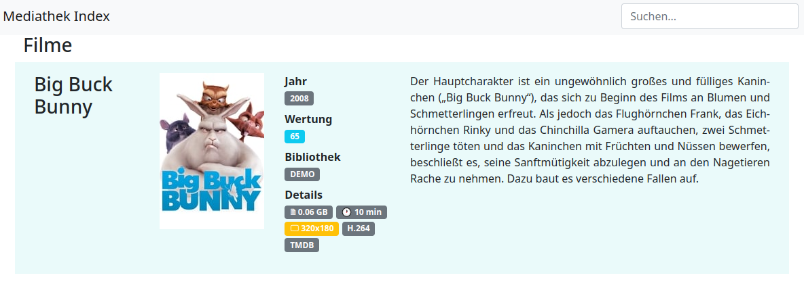

# TVthe(k)Index

Generates an index of tvthek/mediathek downloaded content and queries [TMDB](https://www.themoviedb.org/) for the meta data

## Example

## Usage (version 0.5.0)

### Prerequisites

Register at [TMDB](https://www.themoviedb.org/) and [get an API key](https://www.themoviedb.org/documentation/api).

### from binary (windows)

1. download binaries from [packages](https://gitlab.mplx.eu/scripts/tvthekidx/-/packages) and rename to `tvthekidx.exe`

2. create database

`tvthekidx.exe -v maintenance -d tvthek.db -a createdb`

3. run the indexer

`tvthekidx.exe -v index -k "APIKEY" -d tvthek.db -t movies -c "TVthek" -p x:\TVThek --recursive`

(insert your TMDB API key instead of `APIKEY`)

4. generate the html file

`tvthekidx.exe export -d tvthek.db -c "TVthek" -f html --title "TVthek" --output tvthek.html`

5. if you add or remove content run steps 3 + 4 again

6. occasionally run database maintenance

`tvthekidx.exe -v maintenance -d tvthek.db -a compressdb`

### from binary (linux)

1. download binaries from [packages](https://gitlab.mplx.eu/scripts/tvthekidx/-/packages) and rename to `tvthekidx`

2. make tvthekidx executable

`chmod +x tvthekidx`

3. create database

`./tvthekidx -v maintenance -d tvthek.db -a createdb`

4. run the indexer

`./tvthekidx -v index -k "APIKEY" -d tvthek.db -t movies -c "TVthek" -p /mnt/TVThek/ --recursive`

(insert your TMDB API key instead of `APIKEY`)

5. generate the html file

`./tvthekidx export -d tvthek.db -c "TVthek" -f html --title "TVthek" --output tvthek.html`

6. if you add or remove content run steps 4 + 5 again

7. occasionally run database maintenance

`./tvthekidx -v maintenance -d tvthek.db -a compressdb`

### from python source

1. download source code from [releases](https://gitlab.mplx.eu/scripts/tvthekidx/-/releases)

2. install requirements

`pip install -e .`

3. create database

`tvthekidx -v maintenance -d tvthek.db -a createdb`

4. run the indexer

`tvthekidx -v index -k "APIKEY" -d tvthek.db -t movies -c "TVthek" -p /mnt/TVThek/ --recursive`

(insert your TMDB API key instead of `APIKEY`)

5. generate the html file

`tvthekidx export -d tvthek.db -c "TVthek" -f html --title "TVthek" --output tvthek.html`

6. if you add or remove content run steps 4 + 5 again

7. occasionally run database maintenance

`tvthekidx -v maintenance -d tvthek.db -a compressdb`

## Global arguments

- `-q`, `--quiet` quiet (set verbose to 0)
- `-v`, `--verbose` increase verbosity (stackable)

## `index` arguments

- `-d`, `--database` SQLite database file
- `-p`, `--path` path to scan for video files
- `-k`, `--key` TMDB API key
- `-t`, `--type` content type (`movies`; tvshows not yet supported)
- `-c`, `--collection` collection name
- `-r`, `--recursive` scan subdirectories recursively

## `export` arguments

- `-d`, `--database` SQLite database file
- `-c`, `--collection` comma-separated list of collections to include
- `-f`, `--format` export format plugin (`html`, `text`); default `html`

### HTML plugin arguments (passed after `export`)

- `--title` page title
- `--output`, `-o` output file (default `tvthek.html`)
- `--graphics` image handling: `embed` (default, base64 inline), `reference` (external files), `disable`
- `--skip-actors` omit the actors/crew section
- `--skip-header` omit the top-rated and newest-additions header sections
- `--url` hyperlink prefix for video file links (default `./`)

## `maintenance` arguments

- `-d`, `--database` SQLite database file
- `-a`, `--action` one of:
  - `createdb` — create a new database
  - `upgradedb` — run schema migrations on an existing database
  - `compressdb` — deduplicate movies and VACUUM
  - `detecttvstations` — run ML-based TV station detection on stored screenshots
  - `cleartvstations` — remove all TV station assignments
  - `getscreenshots` — capture/backfill screenshots for files (requires `-p`)
  - `clearscreenshots` — delete all stored screenshots
- `-p`, `--path` path to video files (required for `getscreenshots`)
- `-c`, `--collection` collection filter (optional for `getscreenshots`)

## `tags` arguments

- `-d`, `--database` SQLite database file
- `-a`, `--action` one of: `list`, `add`, `delete`, `export`
- `-t`, `--tag` tag name
- `-r`, `--regex` regular expression pattern matched against filenames
- `--all` delete all tags (use with `--action delete`)

## What's new in 0.5.0

- **Export plugin system** — export format is now selectable via `--format`; `html` and `text` plugins included
- **TV station detection** — screenshots are analysed with a convolutional neural network (CNN) to identify the recording channel; logos are embedded in the HTML export
- **Tags** — regex-based file tagging with the new `tags` subcommand
- **`maintenance` subcommand** — replaces `database`; adds `detecttvstations`, `cleartvstations`, `getscreenshots`, `clearscreenshots` actions
- **`--graphics` export option** — choose between embedded base64, external file references, or disabled images
- **HTML export performance** — ~7× faster; bulk SQL queries replace per-movie/per-file round-trips; SQLite mmap and page-cache tuning cuts system time by ~190×
- **Database schema v9** — all binary attachments (posters, actor profiles, screenshots) unified in a single `attachments` table with a composite index on `(ref_id, type)`
- **CI pipeline upgraded to Debian trixie** — build image updated to `python:3-slim-trixie`; test matrix updated to bookworm and trixie; win64 removed
